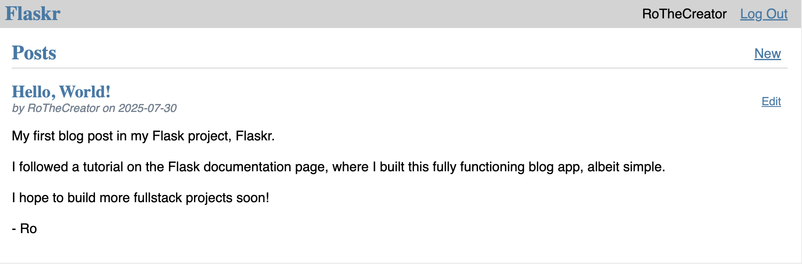

# Flaskr Personal Project

In this project, I built a full-stack development project using several coding languages to create a blog called Flaskr. The blog application will allow users to register, log in, create new posts, and edit/delete their posts on this locally-run app. Furthermore, the app can be packaged and sent to other local computers.

## Overview

### Author
- Created by Rolando Mancilla-Rojas
   * My [GitHub](https://github.com/ro-the-creator)
   * My [LinkedIn](https://www.linkedin.com/in/rolandoma33/)
 
- Project Created July 29, 2025

### Sources

- [Flask Tutorial](https://flask.palletsprojects.com/en/stable/tutorial/)

- [w3 Resources](https://www.w3resource.com/index.php)

***

## Features

The project consisted of __init__.py and auth.py files for initiating and authenticating the app, while also including a db.py that communicated with a database. Languages/Libraries used include:

- Python
- SQL
- HTML
- CSS

I had an emphasized focus on Python and SQL, given my background as a data analyst. This project uses the lightweight SQLite3 to create a local database in which to store registered usernames and passwords.

Something to note: the CSS styles were given to give a greater focus on the implementation of Flask within Python.

## Dependencies

Specifically within Flask, several packages were installed that allowed for user authentication, security, and communication with the database. As stated on the documentation page, dependencies include:

- **Werkzeug** implements WSGI, the standard Python interface between applications and servers.

- **Jinja** is a template language that renders the pages your application serves.
  - **MarkupSafe** comes with Jinja. It escapes untrusted input when rendering templates to avoid injection attacks.

- **ItsDangerous** securely signs data to ensure its integrity. This is used to protect Flask’s session cookie.

- **Click** is a framework for writing command line applications. It provides the ``flask`` command and allows adding custom management commands.

- **Blinker** provides support for **Signals**.

## Installation

When fully installed and running, you can visit the blog at [http://127.0.0.1:5000/auth/login](http://127.0.0.1:5000/auth/login)!

***

> [!NOTE]
> This is a Flask tutorial project from the [Flask Documentation Page](https://flask.palletsprojects.com/en/stable/). The full tutorial can be found [here](https://flask.palletsprojects.com/en/stable/tutorial/).
